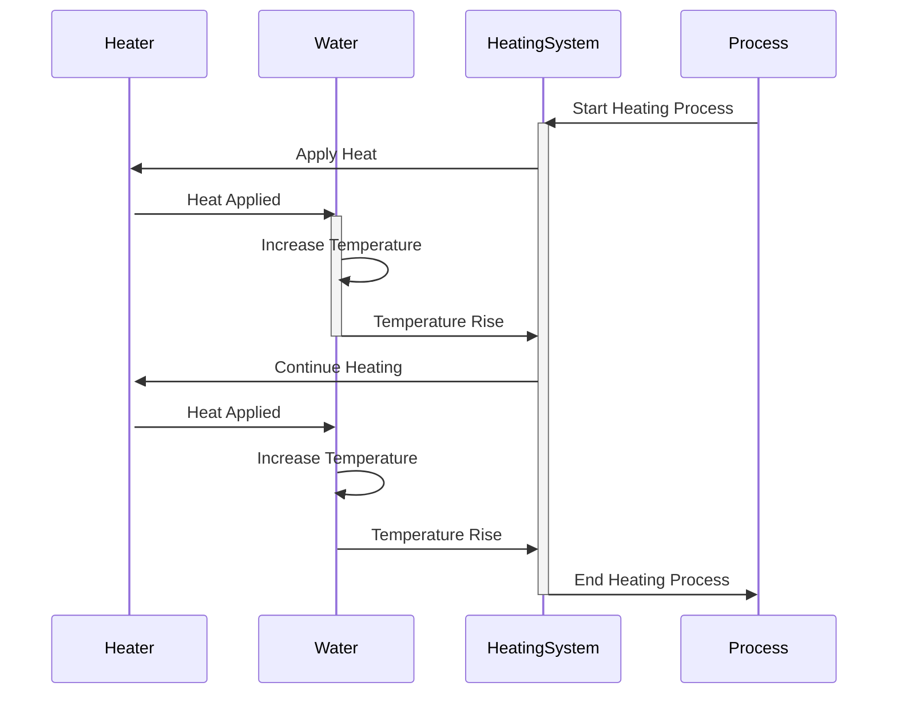
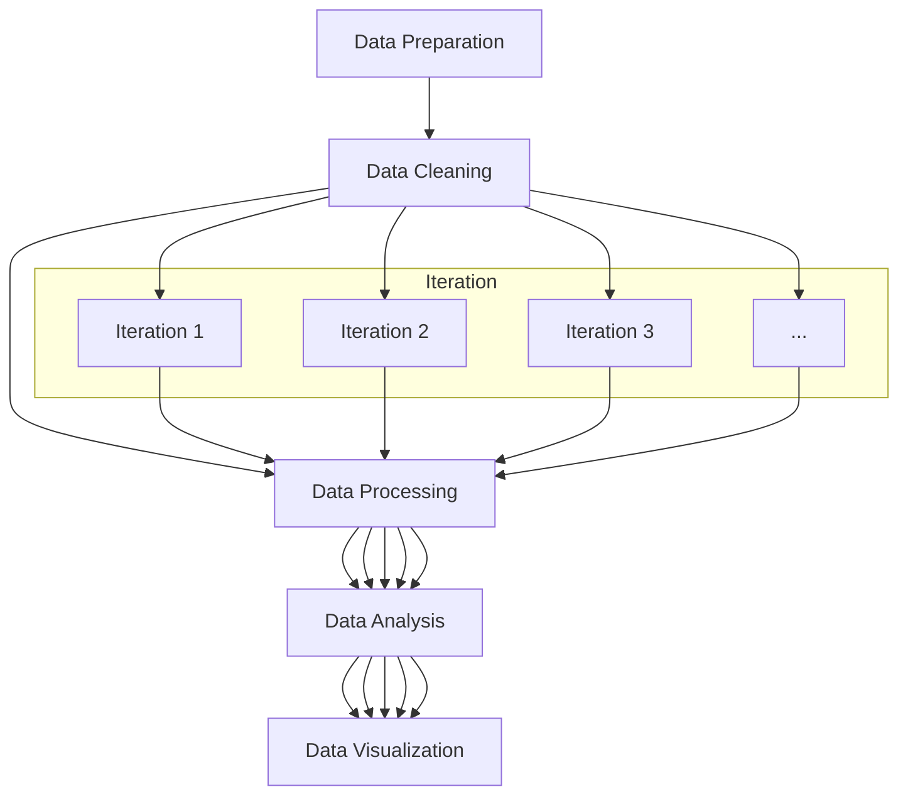

```dot
digraph PhysicalSimulation {
    rankdir=LR;
    node [shape=ellipse, style=filled, fillcolor=lightgrey];

    // 定义实体节点
    entity_water [label="Entity: Water"];
    entity_heater [label="Entity: Heater"];
    
    // 定义聚合节点
    aggregate_heating_system [label="Aggregate: Heating System"];
    
    // 定义事件节点
    event_heat_applied [label="Event: Heat Applied"];
    event_temperature_rise [label="Event: Temperature Rise"];
    
    // 定义过程节点
    process_heating [label="Process: Heating Process"];

    // 定义状态节点
    state_initial [label="State: Initial"];
    state_heated [label="State: Heated"];
    
    // 实体和聚合的关系
    entity_water -> aggregate_heating_system [label="part of"];
    entity_heater -> aggregate_heating_system [label="part of"];

    // 事件引起状态变化
    event_heat_applied -> state_heated [label="causes"];
    event_temperature_rise -> state_heated [label="causes"];

    // 状态变化引起的事件
    state_initial -> event_heat_applied [label="triggers"];
    state_heated -> event_temperature_rise [label="triggers"];

    // 过程包含多个事件
    process_heating -> event_heat_applied [label="includes"];
    process_heating -> event_temperature_rise [label="includes"];
    
    // 状态和实体的关系
    state_initial -> entity_water [label="state of"];
    state_heated -> entity_water [label="state of"];
    
    // 事件和实体的关系
    event_heat_applied -> entity_heater [label="involves"];
    event_temperature_rise -> entity_water [label="involves"];
    
    // 聚合包含状态
    aggregate_heating_system -> state_initial [label="initial state"];
    aggregate_heating_system -> state_heated [label="final state"];
}

```

```mermaid
sequenceDiagram
    participant Heater
    participant Water
    participant HeatingSystem
    participant Process

    Process ->> HeatingSystem: Start Heating Process
    activate HeatingSystem
    
    HeatingSystem ->> Heater: Apply Heat
    activate Heater
    Heater ->> Water: Heat Applied
    activate Water
    Water ->> Water: Increase Temperature
    Water ->> HeatingSystem: Temperature Rise
    deactivate Water
    
    HeatingSystem ->> Heater: Continue Heating
    Heater ->> Water: Heat Applied
    Water ->> Water: Increase Temperature
    Water ->> HeatingSystem: Temperature Rise

    HeatingSystem ->> Process: End Heating Process
    deactivate HeatingSystem
```

```mermaid
graph TD;
    A[Data Preparation] --> B[Data Cleaning];
    B --> C[Data Processing];
    C --> D[Data Analysis];
    D --> E[Data Visualization];

    subgraph Iteration
        I1[Iteration 1];
        I2[Iteration 2];
        I3[Iteration 3];
        In[...];
    end

    B --> I1;
    I1 --> C;
    C --> D;
    D --> E;

    B --> I2;
    I2 --> C;
    C --> D;
    D --> E;

    B --> I3;
    I3 --> C;
    C --> D;
    D --> E;

    B --> In;
    In --> C;
    C --> D;
    D --> E;
```