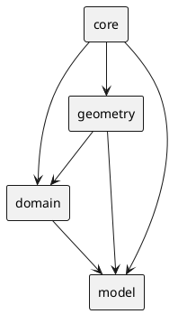

# SpDM 设计

# 组织架构

```plantuml
@startuml
skinparam rectangleBorderThickness 1

rectangle "core" as core
rectangle "geometry" as geometry
rectangle "domain" as domain
rectangle "model" as model

core  --> geometry

core        --> domain
geometry    --> domain


core        --> model
geometry    --> model
domain      --> model


@enduml
```
