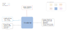

.. venco.py documentation source file, created for sphinx

.. _diarybuilders:

DiaryBuilders Level
===================================

DiaryBuilders Input
---------------------------------------------------
**Config File (user_config.yaml):**

* time_resolution: <value> - User-specific time resolution in minutes
* is_week_diary: bool - Determine if the activity data set comprises weekly
  activity chains (synthesized by WeekDiaryBuilder)

**venco.py Classes:**

 * FlexEstimator class output

DiaryBuilders Output
---------------------------------------------------

**Output Functions:**

 * diary = DiaryBuilder(configs=configs, activities=flex.activities)
 * diary.create_diaries()

**Disk Files:**

 * Electric battery drain (.csv) `drain`
 * Available charging power (.csv) `charging_power`
 * Uncontrolled charging profile (.csv) `uncontrolled_charging`
 * Maximum battery energy level (.csv) `max_battery_level`
 * Minimum battery energy level (.csv) `min_battery_level`

DiaryBuilders Structure
---------------------------------------------------

DiaryBuilder Class
#################################################################

TimeDiscretiser Class
#################################################################
The discretisation approach implemented in venco.py varies according to the
considered profile. Below the different approaches are presented:

- Profile for uncontrolled charging `uncontrolled_charging`: The uncontrolled charging profile is discretised
  dynamically (function
  :py:meth:`diarybuilders.TimeDiscretiser.__value_non_linear_charge`). This means
  the value for each timestamp is calculated using a non-linearly increasing
  list of values capped to the upper battery capacity. The
  discretisation approach changes depending on whether the vehicles are
  driving (function
  :py:meth:`diarybuilders.TimeDiscretiser.__uncontrolled_charging_driving`) or are parked (function
  :py:meth:`diarybuilders.TimeDiscretiser.__uncontrolled_charging_parking`).  
- Profile for the electric demand `drain`: The discretisation and timeseries
  creation for the drain profiles is carried out by distributing the value for
  the profile equally across the number of timestamp in which there is an
  electric consumption (function
  :py:meth:`diarybuilders.TimeDiscretiser.__value_distribute`). A 10kWh electric
  consumption in a 15 minutes resolution results for example in a specific
  consumption of 2.5kWh for each of the 4 timestamps in one hour.
- Profile for the charging capacity of the fleet `charging_power`: The charging
  power profiles is discretised in which the same value is assigned for each
  timestamp in which there is a connection capacity available, independently of
  the temporal resolution selected by the user (function
  :py:meth:`diarybuilders.TimeDiscretiser.__value_select`)
- Maximum and minimum battery level profile `max_battery_level` and
  `min_battery_level`: Similarly to the uncontrolled charging profile, the minimum and maximum battery level are also discretised
  dynamically (function
  :py:meth:`diarybuilders.TimeDiscretiser.__value_non_linear_level`). This means
  the values for each timestamp are calculated using a non-linearly increasing
  list of values capped to upper and lower battery capacity limitations. The
  discretisation approaches changes depending on whether the vehicles are
  driving (function
  :py:meth:`diarybuilders.TimeDiscretiser.__delta_battery_level_driving`) or are parked (function
  :py:meth:`diarybuilders.TimeDiscretiser.__delta_battery_level_charging`). 