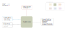

.. venco.py documentation source file, created for sphinx

.. _flexestimators:

FlexEstimators Level
===================================

FlexEstimators Input
---------------------------------------------------
**Config File (user_config.yaml):**

* filter_fuel_need: bool - Should activity chains that require fuel for trip distance satisfaction be filtered out?
* battery_capacity: <value> - Capacity in kWh of the vehicle battery 
* electric_consumption: <value> - Electric consumption in kWh/100km, input assumption for specific electric consumption
* fuel_consumption: <value> - Fuel consumption in l/100km, input assumption for specific fuel consumption for auxiliary fuel
* start_soc: <0-1> - State-of-Charge between 0 and 1 at beginning of activity chain
* maximum_soc: <0-1> - Percentage of maximum available battery capacity
* minimum_soc: <0-1> - Percentage of minimum available battery capacity
* max_iterations: <value>  - Technical parameter
* epsilon_battery_level: <value>  - Iterations stop once the difference between start and end battery level have decreased to this share of fleet battery level

**venco.py Classes:**

* GridModeller class output

FlexEstimators Output
---------------------------------------------------

**Output Functions:**

* flex = FlexEstimator(configs=configs, activities=grid.activities)
* flex.estimate_technical_flexibility_through_iteration()

**Disk Files:**

 * Electric battery drain (.csv) `drain`
 * Available charging power (.csv) `charging_power`
 * Uncontrolled charging profile (.csv) `uncontrolled_charging`
 * Maximum battery energy level (.csv) `max_battery_level`
 * Minimum battery energy level (.csv) `min_battery_level`

FlexEstimators Structure
---------------------------------------------------

FlexEstimator Class
#################################################################

Output Profiles
---------------------------------------------------

Below are the specifications of the output modules. This is important, because the output produced holds only numbers without any units. These
specifications describes how these values can be interpreted when venco.py is configured correctly. Different steps of filtering, aggregation,
correction and normalization are performed for the six profiles. Thus, it is important to understand what the numbers in the output files refer to.
venco.py outputs a total of 6 profiles, 4 flow profiles (demand profiles) and 2 state profiles (energy levels).

*************
Flow Profiles
*************

Profile for connection capacity of the fleet `charging_power`
############################################################

General description
*************************
This profile represents the hourly maximum charging capacity of the electric vehicle fleet. Charging can never be higher than this profile but may be
lower since not all charging stations run on full capacity or it is attractive for balancing renewable feed-in to not charge at full capacity.
Currently, only one charging capacity per run of venco.py can be taken into account.

**Units:** Profiles are in percentage (between 0 and 1), defined as share of number of vehicles of the overall vehicle fleet.

Calculation steps
*************************
1. The profile is calculated based on each plug profile which is a basic input into venco.py. The input profile is made
up of boolean values describing if the respective vehicle is connected to the grid (1, Yes, True) or not (0, No, False). This hourly boolean profiles
are multiplied with the charging capacity e.g. 3.7 kW for a simple home charger.

We're left with 18000 hourly profiles in kW. Functions: calcChargeProfiles() in the library `libProfileCalculation.py`.

2. The profiles are filtered according to a specified selector. If 1000 profiles don't fulfill the selection criteria,
we're left with 17000 profiles still in hourly values of kW. Function: `filterConsProfiles()` in the library `libProfileCalculation.py`.

3. The filtered individual profiles are then aggregated by a simple averaging of each hourly value to calculate the
average electricity consumption for one model vehicle for the complete EV fleet. We're left with one profile in hourly values of kW. Function:
`aggregate_profiles()` in the library `libProfileCalculation.py`. profile in hourly values of kW. Function: `aggregate_profilesMean()` in the library
`libProfileCalculation.py`.

This profile may later be scaled by the number of vehicles in an EV fleet and the average rated connection capacity per vehicle to calculate the
average maximum hourly recharge capacity of the EV fleet.

Profile for uncontrolled charging `uncontrolled_charging`
#################################################################

General description
*************************

For each individual trip and plug profile, one uncontrolled charging profile is calculated. This describes the electric flow of the grid to the
battery under the assumption that the battery is fully charged at beginning of the day. If the battery SOC decreases through a trip and the vehicle is
connected to the grid, charging occurs with full capacity until the battery is fully charged.

**Units:** Profiles are in kWh per chosen resolution of the representative average vehicle.

Calculation steps
*************************

1. The profile is calculated based on each maximum charge profile. It is equal to every positive difference between the
maximum SOC in the current hour minus the SOC in the previous hour. Since the maximum SOC profiles adheres to the maximum charging capacity,
uncontrolled charging may never overshoot the threshold of the defined maximum charging capacity.

We're left with 18000 profiles in kW. Function: `calcChargeProfilesUncontrolled()` in the library `libProfileCalculation.py`.

2. The profiles are filtered according to a specified selector. If 1000 profiles don't fulfill the selection criteria,
we're left with 17000 profiles still in hourly values of kW. Function: `filterConsProfiles()` in the library `libProfileCalculation.py`.

3. The filtered individual profiles are then aggregated by a simple averaging of each hourly value to calculate the
average uncontrolled charging power for one "representative" vehicle for the complete EV fleet. We're left with one

profile in hourly values of kW. Function: `aggregate_profilesMean()` in the library `libProfileCalculation.py`.

4. The aggregated profile is then corrected according to more realistic specific electric consumption measurements.
Function: `correctProfiles()` in the library `libProfileCalculation.py`.

This profile may later be scaled by the number of vehicles in an EV fleet to calculate the fleet uncontrolled charging electric flow.

Profile for electric demand `drain`
#################################################################

General description
*************************

Each trip profile implies a specific electricity consumption that represents the time-specific electricity-outflow from the battery to the electric
motor for the purpose of propulsion of the vehicle. In the calculation of the electric consumption profile, a potential additional fuel demand for
longer trips than feasible with the assumed battery capacity is subtracted to result in the purely electric consumption.

**Units:** Profiles are in kWh of the representative average vehicle.

Calculation steps
*************************

1. The profile is calculated based on each drive profile which is a basic input into venco.py. The individual drive
profiles are scaled with the electric consumption given in the technical vehicle characteristics. If the battery capacity doesn't suffice for the trip
distance, additional fuel demand is subtracted to only account for electricity consumption.

We're left with 18000 hourly profiles in kW. Functions: `calcDrainProfiles()` and `calcElectricPowerProfiles()` in the library
`libProfileCalculation.py`.

2. The profiles are filtered according to a specified selector. If 1000 profiles don't fulfill the selection criteria,
we're left with 17000 profiles still in hourly values of kW. Function: `filterConsProfiles()` in the library `libProfileCalculation.py`.

3. The filtered individual profiles are then aggregated by a simple averaging of each hourly value to calculate the
average electricity consumption for one model vehicle for the complete EV fleet. We're left with one profile in hourly values of kW. Function:
`aggregate_profilesMean()` in the library `libProfileCalculation.py`.

4. The aggregated profile is then corrected according to more realistic specific electric consumption measurements.
Function: `correctProfiles()` in the library `libProfileCalculation.py`.

This profile may later be scaled by the number of vehicles in an EV fleet to calculate the average electric flow leaving the EV fleet battery.

**************
State Profiles
**************

Maximum state-of-charge profile `max_battery_level`
#################################################################
Time series containing the maximum energy level of the vehicle batteries.

**Units:** Profiles are in kWh for the average fleet vehicle - usually close to the maximum (average) battery capacity of an average
vehicle.

Minimum state-of-charge profile `min_battery_level`
#################################################################
Time series containing the minimum energy level of the vehicle batteries.

**Units:** Profiles are in kWh for the average fleet vehicle - usually close to the minimum (average) battery security margin of an
average vehicle.

