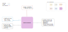

.. venco.py documentation source file, created for sphinx

.. _postprocessors:

PostProcessors Level
===================================

PostProcessors Input
---------------------------------------------------
**Config File (user_config.yaml):**

* start_weekday: 1 - Number corresponding to start day of the week for annual profile (1=Monday)

**venco.py Classes:**

 * ProfileAggregator class output (5 profiles)

PostProcessors Output
---------------------------------------------------

**Output Functions:**

 * post = PostProcessor(configs=configs, profiles=profile)
 * post.create_annual_profiles()
 * post.normalise()

**Disk Files:**

 * Electric battery drain (.csv)
 * Available charging power (.csv)
 * Uncontrolled charging profile (.csv)
 * Maximum battery energy level (.csv)
 * Minimum battery energy level (.csv)

PostProcessors Structure
---------------------------------------------------

**Timeseries Creation and Normalisation**

Weekly or annual timeseries can be created at this stage and a normalisation is carried out for each profile.
The normalisation basis differs for each profile:
- Profile for uncontrolled charging `uncontrolled_charging`: normalised over the annual sum (function :py:meth:`postprocessors.PostProcessor.__normalize_flows`)
- Profile for the electric demand `drain`: normalised over the annual sum (function :py:meth:`postprocessors.PostProcessor.__normalize_flows`)
- Profile for the charging capacity of the fleet `charging_power`: normalised according to the number of vehicle for each weekday (function :py:meth:`postprocessors.PostProcessor.__normalize_charging_power`)
- Maximum and minimum battery level profile `max_battery_level` and `min_battery_level`: normalised according to the assumed vehicle battery size (function :py:meth:`postprocessors.PostProcessor.__normalize_states`)